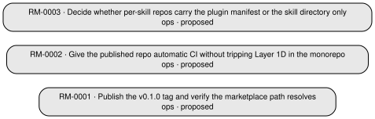

<!-- generated by roadmap.py render — source: docs/roadmap/roadmap.json sha256:cf9c0fd7759844d572ec5ec4651f464e90452f696fb67ee3570f3cba8635768c — do not edit by hand -->

# Roadmap — task:odin-skills

Living inventory of every feature, page, function, integration and operational need. Generated from `docs/roadmap/roadmap.json`; regenerate with `/roadmap render`.

**3 items** — proposed 3 · ready 0 · in-progress 0 · done 0 · dropped 0

Last updated 2026-08-17 · last reconciled never

## Next up (unblocked)

| ID | Kind | Title | Tier | Priority | Links |
| --- | --- | --- | --- | --- | --- |
| RM-0001 | ops | Publish the v0.1.0 tag and verify the marketplace path resolves | next | — | ADR docs/adr/0001-distribution-monorepo-and-per-skill-repos.md |
| RM-0002 | ops | Give the published repo automatic CI without tripping Layer 1D in the monorepo | next | — | — |
| RM-0003 | ops | Decide whether per-skill repos carry the plugin manifest or the skill directory only | next | — | — |

## Dependency graph

## All items by tier

### next (3)

| ID | Kind | Status | Title | Deps | Phase |
| --- | --- | --- | --- | --- | --- |
| RM-0001 | ops | proposed | Publish the v0.1.0 tag and verify the marketplace path resolves | — | — |
| RM-0002 | ops | proposed | Give the published repo automatic CI without tripping Layer 1D in the monorepo | — | — |
| RM-0003 | ops | proposed | Decide whether per-skill repos carry the plugin manifest or the skill directory only | — | — |

## Coverage by kind

| Kind | Total | Done |
| --- | --- | --- |
| ops | 3 | 0 |
