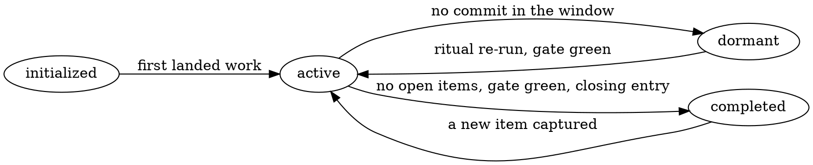

# Four states, and the evidence each transition requires

## Why evidence and not a status field

A state somebody sets by hand is a claim about the tree, and claims go stale without anything
changing. So no state is stored anywhere: each one is a **predicate over the project's own tree**,
and every transition below names the observation that permits it plus the command that produces
that observation.

This is the discipline the roadmap engine already applies to items, applied one level up. It is
also why there is no harness-side registry of projects or their states — a registry is a stored
status field with extra steps, and it would couple the harness to a project in the way the
isolation contract forbids.

Throughout: `P=projects/<slug>`.



There is deliberately **no `dormant → completed` edge.** Completion requires zero open items, and
closing items is work; a dormant project with open items becomes active first, or its items are
dropped through the roadmap engine — which is itself work.

## The states

| State | Means | Read it with |
|---|---|---|
| `initialized` | The subtree exists and declares itself, but nothing has landed | `test -f "$P/README.md"` and no commit touching `$P` beyond the one that created it |
| `active` | Work is landing | a commit touching `$P` inside the dormancy window |
| `dormant` | Open items remain; nobody is working on it | no commit touching `$P` inside the window, and the roadmap still reports open items |
| `completed` | Nothing remains, and the tree says so | zero open items, gate green, closing entry in the project's changelog |

## The transitions

### → `initialized`

**Evidence:** the subtree exists, names its own goal and scope, declares its memory namespace, and
names the command that is its gate.

```sh
test -f "$P/README.md" && git log --oneline -- "$P" | tail -1
```

An `initialized` project that cannot name its gate is not initialized — it is a directory.

### `initialized` → `active`

**Evidence:** work has landed. At least one commit touching the subtree beyond the one that created
it, and a roadmap holding at least one item.

```sh
git log --oneline -- "$P" | wc -l          # more than 1
test -f "$P/docs/roadmap/roadmap.json"
```

### `active` → `dormant`

**Evidence:** no commit has touched the subtree within the dormancy window, and open items remain.

```sh
git log -1 --format=%cI -- "$P"            # compare against the window
```

**The window is 30 days**, chosen because it is computable rather than judged. A shorter window
calls a normal gap dormancy; a longer one lets a project rot for a quarter while still reading as
active. Projects vary, so a project whose cadence makes 30 days wrong states its own window in its
README — and states it as a number, not as a temperament.

Dormancy is a fact, not a verdict. It is worth knowing because a dormant project's gate has been
rotting against a moving dependency tree, which is what the next transition exists to catch.

### `dormant` → `active`

**Evidence:** the project-switch ritual has been re-run *and* the project's own gate is green at the
current `HEAD` — not at the sha where it went dormant.

A dormant project's gate is the one thing that decays without any commit to blame, because its
dependencies, its toolchain and the harness around it all moved while it sat still. Waking a project
by editing it, and discovering later that the gate had been red since before you arrived, makes
every subsequent red unattributable.

### `active` → `completed`

**Evidence**, all three:

1. The project's roadmap reports **zero open items**, read from the engine rather than by eye.
2. The project's own gate is **green at the current `HEAD`**.
3. Its changelog carries the entry that says the work is finished.

None of these is "the work feels done". A project declared complete with open items has not
completed; it has stopped.

### The shape of the `completed` exit

Completion has two shapes, and which one applies is recorded in the harness's `projects/README.md`
row for that project, not inferred:

- **Extracted** — the project became independently useful, versioned or shared, so it moved to its
  own repository and the harness keeps only a pointer.
- **Retained** — it stays in the subtree, with the reason stated. Retention needs a reason on
  record, because the default in the isolation contract is extraction.

### `completed` → `active`

**Evidence:** a new item exists in the project's roadmap, captured through the engine. Reopening is
not a mood either; it is an item.
