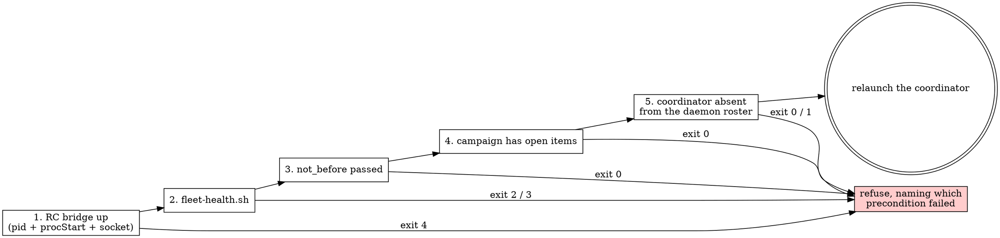

# revive — the fleet comes back on its own

## What this is not for

This skill owns one thing nothing else owns: **what restarts a fleet that has stopped, and what
proves it should be restarted at all.** Everything around it already has an owner. Route there.

| The task | Its owner | Why not this skill |
|---|---|---|
| Provisioning, launching, integrating, tearing down; the six-element handoff bar | `successor` | It owns the five phases. This skill launches exactly one session — a campaign's coordinator — and that coordinator then runs Phase 1 for its own workers. The bar is cited here, never restated. |
| What is true of one delegated session right now | `successor-manager` | It owns the ownership register and the five verdicts. This skill asks a narrower question — present or absent — and asks it of the same channels. |
| What a campaign contains, and whether it may close | `campaign` | The revival manifest **references** a campaign by slug and copies nothing from it. Whether the work is finished is that engine's answer, forwarded. |
| Handing this session forward, once | `handoff` / `/relay` | A deliberate one-off with a human present. Revival is what happens when nobody is. |
| Whether to keep going at all | `endless` | Continuation doctrine. This skill restarts what was already decided; it never decides to start something new. |
| One bounded cycle and its ledger | `work-loop` | A loop asks whether to run again inside a session. This asks whether a session should exist. |
| Deleting the residue afterwards | `tidy` | This engine issues no delete verdicts, prunes nothing, and retires no row. |

## The stance

**A schedule may not decide what to do; it may only decide when to look.**

The cadence is dumb — two crontab entries, always the same, gated on nothing. Every decision lives
in a committed manifest and in facts measured at the moment the tick fires. That split is the whole
design, and it is what makes the mechanism survive the two-day gap it exists for: a handoff written
on Saturday and fired on Monday describes a fleet that has moved, and a status written into a file
reads identically whether it is current or six hours old.

So the manifest stores **the assignment and a not-before instant**, and never a status. `campaign`
refuses a stored status for the same reason (ADR-0113); this is that rule applied to the second file
that could carry one, and `revival-manifest-check.sh` refuses `status`, `state` and `progress` at any
depth rather than at the top level, because the field people actually add is a note inside a role row.

## The five preconditions, in order

A launch happens only when all five hold. The order is the substance: each channel after the first
cannot report its own absence.



1. **The bridge**, because a session launched without it is unreachable, unlistable and unstoppable.
   Checked as pid **plus `procStart`** plus a control socket — a pid alone is reused within hours on
   a busy host, and a liveness test that reads only the number passes forever.
2. **The daemon**, via `fleet-health.sh`, whose 2 and 3 are forwarded unchanged. Without this, step 5
   is meaningless: a registry outlives the daemon that served it, and on 2026-08-19 five dead
   sessions rendered as ordinary for eight hours (M-0014, ADR-0072).
3. **The not-before**, read from the manifest. A weekly limit, a maintenance window or a deliberate
   pause is a fact about the work, so it lives with the work.
4. **Open items**, from the `campaign` engine. Its `undetermined` is forwarded, never collapsed into
   "nothing to do" — those are different sentences.
5. **Absence**, from the daemon's roster. Never from the session's own `state`: a wedged session
   reports `running`, and a dead one reports whatever the registry last knew.

## Why only the coordinator

A cron job that also launched workers would be a second actor provisioning worktrees and reserving
identifiers for the same items — the collision `successor` Phase 1 exists to prevent, arriving from a
new direction. So an absent worker is a **finding**, reported for the coordinator to act on, and the
coordinator revives its own fleet the way it always would.

## The commands

```sh
bash .claude/scripts/fleet-revive.sh --dry-run     # what would happen, launching nothing
bash .claude/scripts/fleet-revive.sh               # the decision, for real
bash .claude/scripts/fleet-heartbeat.sh --once     # one line appended; decides nothing
bash .claude/scripts/revival-manifest-check.sh     # the manifest is a plan, not a status
bash .claude/scripts/revival-cron.sh status        # armed? and what would a tick do?
bash .claude/scripts/revival-cron.sh install       # two entries; idempotent
bash .claude/scripts/revival-cron.sh remove        # exactly what install wrote, and nothing else
```

Exit codes are the interface, so a caller greps nothing:

| Code | Means |
|---|---|
| `0` | nothing to do, or a launch was decided and performed |
| `1` | findings — a missing worktree, an absent worker under a live coordinator |
| `2` | the session daemon is down (forwarded) |
| `3` | a channel could not be read (forwarded, or this engine's own fail-closed) |
| `4` | the remote-control bridge is down |
| `64` | usage |

## The record

One JSON manifest per campaign under `.claude/docs/revival/<slug>.json`, committed. What it holds,
field by field, and what it deliberately does not:
[revival-record.md](references/revival-record.md).

## What the heartbeat is for

It decides nothing and launches nothing. It appends one line per tick — the instant, the bridge
verdict, the live session ids, the open-item count — because after the 12h36m gap that produced this
skill, **nobody could say when the fleet went quiet.** Every channel that could have answered was a
snapshot of the present, and a snapshot cannot date an absence. A count it could not obtain is
written `?`, never `0`: an invented zero reads as a finished campaign.

## Red flags

| Thought | Reality |
|---|---|
| "The brief says it is an endless run" | A brief is not a mechanism. That is the exact finding this skill remedies (`harness:RM-0395`). |
| "I'll write the handoffs now so they are ready" | They will describe a fleet that has moved. Generate at fire time, from measurements. |
| "The manifest can note which wave we reached" | That is a status, and `revival-manifest-check.sh` refuses it. Ask the campaign engine. |
| "The roster is empty, so nothing is running" | An unreadable roster is not an empty one. Exit 3, and launch nothing. |
| "The supervisor pid is alive, so the bridge is up" | Pids are reused. Check `procStart` too. |
| "A systemd user timer is the right tool" | It is — on a host with linger enabled. `Linger=no` means user timers die at logout, which is the case this exists for. |
| "One cron line for Monday at 21:00" | Cron has no year field, a powered-off host misses the minute, and the line must then delete itself. |
| "It is stalled, so relaunch it" | That is `successor-manager`'s verdict and `successor`'s amended handoff, not this. Revival is for **absent**, not for stuck. |
| "Revive everything at once, it is faster" | Two actors then provision the same worktrees. Coordinator only. |

## Quick reference

| Need | Where |
|---|---|
| What the manifest holds, field by field | [revival-record.md](references/revival-record.md) |
| Delegating one worker, and integrating it | `successor` |
| Is that worker stalled, dead, or landed | `successor-manager` |
| Whether the campaign may close | `campaign` |
| Why landedness is content, never ancestry | `.claude/docs/adr/0093-branch-landedness-is-a-question-about-content.md` |
| Why a session's own report is never evidence | `.claude/docs/adr/0072-liveness-is-never-read-from-the-subject.md` |
| The matrix | `.claude/tests/fleet-revive.test.sh` |
