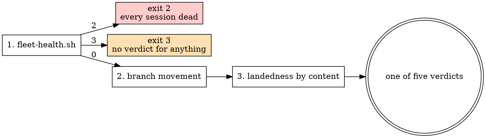

# successor-manager — ownership, and the verdict

## What this is not for

This skill owns two things nothing else owns: **who is responsible for a delegated session**, and
**how that session's state is decided from evidence rather than from its own report of itself.**
Delegation itself already has an owner. Route there instead.

| The task | Its owner | Why not this skill |
|---|---|---|
| Provisioning, launching, integrating, tearing down; the six-element handoff bar | `successor` | It owns the five phases. This skill starts once a session exists and asks what is true of it. Its bar is cited here, never restated — two copies of a bar drift, and the looser copy wins silently. |
| Handing **this** session forward, once | `/relay` | One-off delegation with its own gates. One successor is `/relay`; a fleet is `successor`; this skill is what you consult about either afterwards. |
| Planning a multi-successor campaign, waves, campaign closure | `campaign` — harness:RM-0302, **not yet built** | Waves are a different item. The seam is named, not filled: this skill classifies the sessions a campaign launched; it does not decide what a campaign contains or when it is finished. |
| Parallel work inside one context window | `dispatching-parallel-agents` | Subagents. They share the parent's lifetime, return text, and die with the turn — there is no register row and no verdict to compute. |
| Whether to keep going at all | `endless` | Continuation doctrine. This skill says what happened; it never says whether to carry on. |
| Cost of a session that is progressing but expensive | ADR-0097 | The burn predicate and `.claude/scripts/session-burn.sh` are on `main` (PR #487); what is still open is when spend alone earns an escalation. Named as a seam in [escalation-paths.md](references/escalation-paths.md); nothing here duplicates them. |

## The stance

**A session's own report of itself is never sufficient evidence.**

A wedged session reports that it is running. A dead session reports whatever the registry last knew,
because the registry outlives the daemon that served it — on 2026-08-19 five sessions died together
and went on rendering as ordinary for eight hours (M-0014, ADR-0072). Both are the subject
describing itself, and neither can report its own absence.

So the verdict is computed from channels the subject does not control, in a fixed order, and the
order is the point.

## The three signals, in order



1. **`bash .claude/scripts/fleet-health.sh` first**, because the other two channels cannot report
   their own absence. Its exit code **gates** everything after it: `2` means the daemon is gone and
   every session is dead regardless of what the registry says; `3` means the registry is unreadable
   and **no verdict may be claimed for anything**.
2. **Branch movement** — `git ls-remote --heads origin <branch>` for the published sha, and the
   tip's own commit date against a staleness window.
3. **Landedness by content** — `bl_classify` from `.claude/scripts/lib/branch-landedness.sh`.
   **Never `git merge-base --is-ancestor`**: this repository lands by rebase merge, which rewrites
   every sha, and ancestry answered "not merged" for 56 of 110 branches that had in fact landed
   (ADR-0093).

Each signal is bounded, and the bound is the reason there are three of them. What a signal cannot
answer is not a caveat on the verdict — it is the whole reason the next signal is consulted:

| Signal | What it establishes | Does not establish |
|---|---|---|
| `bash .claude/scripts/fleet-health.sh` | whether the daemon every other channel is served by is alive, and whether a verdict may be claimed at all | anything about one session. A healthy daemon is a precondition, never a finding about a worker. |
| `git ls-remote --heads origin <branch>` | the published sha, and when the tip last moved | that anything landed, and — inside the staleness window — that the session is working rather than pushing noise. Movement is a question about shas. |
| `bl_classify` (`.claude/scripts/lib/branch-landedness.sh`) | whether the branch's content is in the base | *why* a branch is unlanded, and it withholds a verdict outright when the commits pair only partly (`undetermined`). |
| `claude logs <id>` — not one of the three | what a session's screen showed | anything, unless the escapes are stripped first: it exits 0 while returning a screen recording (harness:RM-0340). `handoff` § 3 carries the filter; this skill orders signals and does not restate it. |

The registry's **id set** is the fourth reading, and its bound is the sharpest of all — see below.

The registry's **id set** is consulted, and nothing else from it. Membership is the daemon's account
of who exists, and step 1 has just proved that account current; the per-session field describing how
a session feels is the subject talking.

## Five verdicts, one of them mandatory

| Verdict | What the evidence said | Escalation |
|---|---|---|
| `live` | unlanded, in the registry, branch moved inside the window | none — leave it alone |
| `stalled` | unlanded, in the registry, branch quiet past the window | [escalation-paths.md](references/escalation-paths.md) § Stalled |
| `failed` | unlanded, gone from a registry the health gate proved current | § Failed |
| `landed` | `bl_classify` says the content is in the base | § Landed — retire the row |
| `undetermined` | the channels disagreed, or one could not be read | § Undetermined |

**`undetermined` is mandatory, not a fallback for laziness.** It is the honest answer when a
channel could not look, and a classifier without it invents a verdict silently — which is the
failure the whole ordering exists to prevent.

## The probe

```sh
bash .claude/skills/successor-manager/scripts/successor-status.sh          # the live register
bash .claude/skills/successor-manager/scripts/successor-status.sh --json   # one document
bash .claude/skills/successor-manager/scripts/successor-status.sh --session <id>
```

Exit codes are the interface, so a caller greps nothing: `0` every row live or landed, `1` findings,
`2` daemon down, `3` a register could not be read, `64` usage. `2` and `3` are forwarded from
`fleet-health.sh` unchanged, so a caller that already handles the fleet monitor handles this too.

**It reads only.** No fetch, no write, and it never consumes the state it inspects. Its matrix is
`.claude/tests/successor-status.test.sh`.

## The register

One `key<TAB>value` file per delegated session under `.claude/.runtime/successor-register/`, written
at launch by whoever launched it. What a row records and why each field is there is
[ownership-register.md](references/ownership-register.md). A row is **retired by an explicit act**,
never by an age sweep — the reasoning is in that file, and it is the reason no new retention class
is declared.

## Red flags

| Thought | Reality |
|---|---|
| "`claude agents` says it is running" | That is the subject reporting on itself. Run the health gate first, then read movement. |
| "The branch is not an ancestor of main, so it never landed" | Ancestry is a question about shas; landedness is a question about content. 56 of 110 (ADR-0093). |
| "All the workers show the same state, so the fleet is fine" | Every session reading identically is the signature of a dead daemon, not of agreement. |
| "I could not read the registry, so nothing is wrong" | "I looked and found nothing" and "I could not look" are different answers. That is exit 3. |
| "It is stalled, so relaunch it" | The same handoff produces the same stall. Amend it — and read § Stalled before re-running anything. |
| "Resume from where the transcript stops" | A transcript records what was attempted, not what landed, and a relaunched session has none. |
| "The row can go, the session is gone" | A gone session with an unlanded branch is the `failed` finding. Retiring the row deletes the evidence for it. |
| "It is expensive, so it is stuck" | Burning without progressing is its own pathology, and it is not `stalled`. See the burn seam. |
| "The message was sent, so the worker was told" | A send reports on the send. The fourth channel is the one that reports success and drops the message: nothing on the receiving side is ever wrong to look at, because nothing arrived. Confirm from the worker's own next action — a branch, a commit, a reply — never from the send's exit. |
