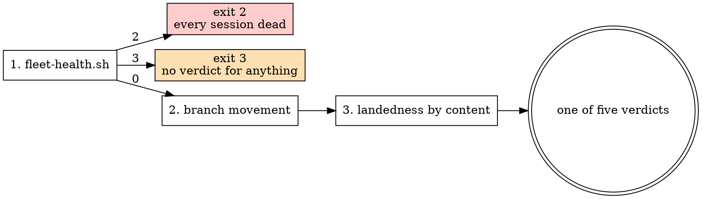

# successor-manager — ownership, and the verdict

## What this is not for

This skill owns two things nothing else owns: **who is responsible for a delegated session**, and
**how that session's state is decided from evidence rather than from its own report of itself.**
Delegation itself already has an owner. Route there instead.

| The task | Its owner | Why not this skill |
|---|---|---|
| Provisioning, launching, integrating, tearing down; the six-element handoff bar | `successor` | It owns the five phases. This skill starts once a session exists and asks what is true of it. Its bar is cited here, never restated — two copies of a bar drift, and the looser copy wins silently. |
| Handing **this** session forward, once | `/relay` | One-off delegation with its own gates. One successor is `/relay`; a fleet is `successor`; this skill is what you consult about either afterwards. |
| Planning a multi-successor campaign, waves, campaign closure | `campaign` | Waves are a different question. This skill classifies the sessions a campaign launched; it does not decide what a campaign contains or when it is finished. The console below routes into it. |
| Parallel work inside one context window | `dispatching-parallel-agents` | Subagents. They share the parent's lifetime, return text, and die with the turn — there is no register row and no verdict to compute. |
| What a session *says* to another session, and what a delegated session's terminal should carry | `s2s` (ADR-0162) | This skill decides what is TRUE of a session; that one decides what it SAYS. The red flag below — a send reports on the send — is where that skill's stance comes from. |
| Whether to keep going at all | `endless` | Continuation doctrine. This skill says what happened; it never says whether to carry on. |
| Cost of a session that is progressing but expensive | ADR-0097 | The burn predicate and `.claude/scripts/session-burn.sh` are on `main` (PR #487); what is still open is when spend alone earns an escalation. Named as a seam in [escalation-paths.md](references/escalation-paths.md); nothing here duplicates them. |

## The orchestration console

The table above says what this skill does **not** own. This one says what a coordinator **runs**, and
it is the positive direction of the same boundary: eleven skills, each owning one phase of a fleet's
life. The console **routes into** them and invokes nothing it owns — a row that absorbed its owner's
procedure would be a second copy of it, drifting from the first the moment either changed.

Read it as a decision table. The left column is a condition observable from where a coordinator
stands; the right column is what that skill alone decides.

| When | Fire | What it owns, and nobody else does |
|---|---|---|
| Nothing is assigned yet — what should the fleet work on | `roadmap` | The item set, the dependency graph, and `waves` — parallel layers computed from the graph, never stored |
| The work spans several `projects/*` subtrees, or one is dormant | `projects` | The switch ritual and the per-project artifact checklist (ADR-0106). `project-manager` is the read-only portfolio join over it |
| An item is picked and the approach is non-obvious | `superplan` | The plan doc, its ≥3 decision forks, and the recorded scope decision. Gate 4 of the roadmap chain |
| One unit of work must become an iteration with a stated end | `work-loop` | The twelve-field cycle contract, six iteration-scoped outcomes, and the resumable ledger (ADR-0103) |
| Several delegated sessions are one piece of work | `campaign` | The manifest that freezes a wave's item set, and `close`, which refuses while any item is unlanded **and refuses separately when landedness could not be determined** (ADR-0113) |
| The backlog must be driven to exhaustion across many sessions | `gauntlet` | The frontier computed at read time, batch freezing, and the re-arm. It refuses "run until zero" by name |
| Two or more independent workers must exist | `successor` | Provision, launch, monitor, integrate, tear down — all five phases, and the six-element handoff bar |
| This one session must hand its work forward | `handoff` (`/relay`) | The document, the launch, and staying on as monitor. One successor; a fleet is the row above |
| A worker must report back, or be told something | `s2s` | What a session **says**: a durable deliverable path, a message that is a pointer to it, an orphan's terminal bounded on narration |
| An item lands and the loop must decide whether to carry on | `endless` | The three checkpoints and the three continuations, burn predicate first. It never decides *what* to work on |
| A chain of these must be named, versioned or retired | `workflows` | The lifecycle of a reusable chain document. Local only — never a remote dispatch |

**Around all eleven: `factory`.** It is the invariant set for a repository that merges its own code
— the unamendable governance files, gates that are code, the dispatcher's fixed priority, moving the
autonomy dial on evidence. A coordinator **consumes** those invariants; it never wraps itself in
them. Wrapping this harness in a factory puts `CLAUDE.md`'s own governance under Layer 1H's
always-on write refusal, and the harness could no longer edit the contract a campaign exists to
improve.

**This skill's own row is the verdict**, which is why it is not in the table: every other row
launches, plans or reports, and this one asks what is *true* of what they launched.

### One command that composes the console's read-only half

```sh
bash .claude/skills/successor-manager/scripts/orchestrate.sh          # the fleet, one screen
bash .claude/skills/successor-manager/scripts/orchestrate.sh --json   # one document
```

`fleet-health.sh` runs **first** and its exit code gates everything after it — `2` means every
session is dead whatever a later probe reports, and `3` means **no verdict may be claimed for
anything**, so the run stops there rather than printing rows nobody may act on. It composes existing
probes and computes nothing of its own.

### The tier a launch chooses by saying nothing

A launched session defaults to **Sonnet** (ADR-0097). Omitting `model:` takes that default and is
the right answer for most work; naming a non-default tier **requires** `model_reason:`, and
`odin-relay.sh` refuses the launch without one — symmetrically, so `haiku` is refused on the same
terms as `opus`. The failure being guarded is an unstated choice, not an expensive one.

What this costs when nobody says it: 74 of 200 handoffs in one workspace declared `model: opus` and
**none** declared sonnet or haiku, measured 2026-09-03 — a shipped default defeated by copying a
previous brief. A coordinator sizing a wave picks the tier per worker: search and mechanical sweeps
go to `haiku`, ordinary build work takes the default, and cross-branch judgment earns `opus` with the
reason written down. Full rule, both detectors, and what stays unchecked:
[`common/performance.md`](../../rules/common/performance.md) § Where the Tier Is Actually Decided.

## The stance

**A session's own report of itself is never sufficient evidence.**

A wedged session reports that it is running. A dead session reports whatever the registry last knew,
because the registry outlives the daemon that served it — on 2026-08-19 five sessions died together
and went on rendering as ordinary for eight hours (M-0014, ADR-0072). Both are the subject
describing itself, and neither can report its own absence.

So the verdict is computed from channels the subject does not control, in a fixed order, and the
order is the point.

## The three signals, in order



1. **`bash .claude/scripts/fleet-health.sh` first**, because the other two channels cannot report
   their own absence. Its exit code **gates** everything after it: `2` means the daemon is gone and
   every session is dead regardless of what the registry says; `3` means the registry is unreadable
   and **no verdict may be claimed for anything**.
2. **Branch movement** — `git ls-remote --heads origin <branch>` for the published sha, and the
   tip's own commit date against a staleness window.
3. **Landedness by content** — `bl_classify` from `.claude/scripts/lib/branch-landedness.sh`.
   **Never `git merge-base --is-ancestor`**: this repository lands by rebase merge, which rewrites
   every sha, and ancestry answered "not merged" for 56 of 110 branches that had in fact landed
   (ADR-0093).

Each signal is bounded, and the bound is the reason there are three of them. What a signal cannot
answer is not a caveat on the verdict — it is the whole reason the next signal is consulted:

| Signal | What it establishes | Does not establish |
|---|---|---|
| `bash .claude/scripts/fleet-health.sh` | whether the daemon every other channel is served by is alive, and whether a verdict may be claimed at all | anything about one session. A healthy daemon is a precondition, never a finding about a worker. |
| `git ls-remote --heads origin <branch>` | the published sha, and when the tip last moved | that anything landed, and — inside the staleness window — that the session is working rather than pushing noise. Movement is a question about shas. |
| `bl_classify` (`.claude/scripts/lib/branch-landedness.sh`) | whether the branch's content is in the base | *why* a branch is unlanded, and it withholds a verdict outright when the commits pair only partly (`undetermined`). |
| `claude logs <id>` — not one of the three | what a session's screen showed | anything, unless the escapes are stripped first: it exits 0 while returning a screen recording (harness:RM-0340). `handoff` § 3 carries the filter; this skill orders signals and does not restate it. |

**The deliverable is a separate channel**, asked after these three rather than among them, because
its input is optional where theirs are not — see below.

The registry's **id set** is consulted, and nothing else from it. Membership is the daemon's account
of who exists, and step 1 has just proved that account current; the per-session field describing how
a session feels is the subject talking.

## Five verdicts, one of them mandatory

| Verdict | What the evidence said | Escalation |
|---|---|---|
| `live` | unlanded, in the registry, branch moved inside the window | none — leave it alone |
| `stalled` | unlanded, in the registry, branch quiet past the window | [escalation-paths.md](references/escalation-paths.md) § Stalled |
| `failed` | unlanded, gone from a registry the health gate proved current | § Failed |
| `landed` | `bl_classify` says the content is in the base | § Landed — retire the row |
| `undetermined` | the channels disagreed, or one could not be read | § Undetermined |

**`undetermined` is mandatory, not a fallback for laziness.** It is the honest answer when a
channel could not look, and a classifier without it invents a verdict silently — which is the
failure the whole ordering exists to prevent.

## The fourth channel — did the deliverable reach a commit?

The three signals above ask whether the daemon is alive, whether the branch **moved**, and whether
its content **landed**. None of them asks what the branch **contains**, so a session that pushed a
plan doc and left its deliverable uncommitted in a worktree reads `live`, at exit 0. Measured on a
fixture register: two sweep workers in one batch reached `done` having committed only a plan doc and
had to be re-run, and a third's complete deliverable was found by reading the branch by hand
(`harness:RM-0505`).

```sh
bash .claude/skills/successor-manager/scripts/successor-deliverable.sh
bash .claude/skills/successor-manager/scripts/successor-deliverable.sh --json
bash .claude/skills/successor-manager/scripts/successor-deliverable.sh --session <id>
```

Its subject is the row's `deliverable` lines — one glob pattern each, matched against
`git ls-tree -r --name-only` on the branch. What the field is and how to write it:
[ownership-register.md](references/ownership-register.md) § `deliverable`.

| State | The evidence said |
|---|---|
| `shipped` | every declared pattern matched a path on the branch |
| `unshipped` | the branch moved, has been quiet past the window, and a declared path is missing |
| `pending` | declared paths missing, but the branch is still moving — a session mid-flight |
| `no-commits` | the branch has no commits of its own; `successor-status.sh` owns that row |
| `undeclared` | the row declares no deliverable, so nothing is claimed about it |
| `undetermined` | an input could not be read; the DETAIL column names which |

Exit codes: `0` every classified row shipped, pending or no-commits; `1` findings; `3` nothing could
be classified, or a row is undetermined; `64` usage. **3 outranks 1** — exit 1 asserts something
about the rows it did not flag, and one unreadable row makes that assertion unsupportable.

Two properties worth knowing before acting on it. **`pending` is the near miss kept clean**: a
session in its first minutes has pushed a plan doc and nothing else, which is byte-identical to the
defect, and the only observable separating *working toward it* from *finished and forgot* is that
the branch stopped moving. **It answers presence, not correctness** — a stub file at a declared path
satisfies it.

**Nothing writes the field yet.** Launch belongs to `successor`, so against today's register this
reports exit 3 — *no row declares a deliverable* — which is the honest answer and is non-zero.
Matrix: `.claude/tests/successor-deliverable.test.sh`.

## The probe

```sh
bash .claude/skills/successor-manager/scripts/successor-status.sh          # the live register
bash .claude/skills/successor-manager/scripts/successor-status.sh --json   # one document
bash .claude/skills/successor-manager/scripts/successor-status.sh --session <id>
```

Exit codes are the interface, so a caller greps nothing: `0` every row live or landed, `1` findings,
`2` daemon down, `3` a register could not be read, `64` usage. `2` and `3` are forwarded from
`fleet-health.sh` unchanged, so a caller that already handles the fleet monitor handles this too.

**It reads only.** No fetch, no write, and it never consumes the state it inspects. Its matrix is
`.claude/tests/successor-status.test.sh`.

## The register

One `key<TAB>value` file per delegated session under `.claude/.runtime/successor-register/`, written
at launch by whoever launched it. What a row records and why each field is there is
[ownership-register.md](references/ownership-register.md). A row is **retired by an explicit act**,
never by an age sweep — the reasoning is in that file, and it is the reason no new retention class
is declared.

## Red flags

| Thought | Reality |
|---|---|
| "`claude agents` says it is running" | That is the subject reporting on itself. Run the health gate first, then read movement. |
| "The branch is not an ancestor of main, so it never landed" | Ancestry is a question about shas; landedness is a question about content. 56 of 110 (ADR-0093). |
| "All the workers show the same state, so the fleet is fine" | Every session reading identically is the signature of a dead daemon, not of agreement. |
| "I could not read the registry, so nothing is wrong" | "I looked and found nothing" and "I could not look" are different answers. That is exit 3. |
| "It is stalled, so relaunch it" | The same handoff produces the same stall. Amend it — and read § Stalled before re-running anything. |
| "Resume from where the transcript stops" | A transcript records what was attempted, not what landed, and a relaunched session has none. |
| "The branch moved, so the work is happening" | Movement is a question about shas. A branch carrying a plan doc and nothing else has moved exactly as convincingly as one carrying the deliverable — ask the fourth channel. |
| "The row can go, the session is gone" | A gone session with an unlanded branch is the `failed` finding. Retiring the row deletes the evidence for it. |
| "It is expensive, so it is stuck" | Burning without progressing is its own pathology, and it is not `stalled`. See the burn seam. |
| "The message was sent, so the worker was told" | A send reports on the send. The fourth channel is the one that reports success and drops the message: nothing on the receiving side is ever wrong to look at, because nothing arrived. Confirm from the worker's own next action — a branch, a commit, a reply — never from the send's exit. |
