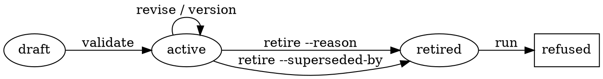

# Workflows — the lifecycle of a reusable chain

## What this is not for

A chain document under `.claude/docs/workflows/` says *which skills fire in which order*
(ADR-0021, superseded on the storage question by ADR-0104). This skill owns the other half — who
owns the chain, which version is current, and whether it is still the right one — by **validating,
versioning, superseding and retiring** the manifest that the chain document carries. It does not
write the chain's prose, and it never executes a step.

| The task | Its owner | Why not this skill |
|---|---|---|
| Running the repository's gate chain | `.claude/scripts/ci-local.sh` | A gate chain is one script with an exit code, not a manifest. |
| Iterating until the work is done | `endless` | This skill emits one chain's steps once. Continuation across items is a different problem. |
| Deciding whether a task-local harness is warranted at all | `dynamic-workflow-mode` | That is a judgment about whether to build; this is the lifecycle of one already built. |
| Writing the prose sequence of skills | the chain's owning skill | The prose says how the work is done; this skill only asserts the manifest that sits in the same file is well-formed and current. |
| Choosing what to work on next | `roadmap` | A workflow is *how* a class of work is done, never *which* work is next. |

## Non-goals, decided

- **No general workflow engine.** `run` resolves a manifest and emits its ordered steps for the
  agent to follow. It executes nothing. A runtime that executes manifest-supplied strings is a
  second harness growing inside the first — ADR-0102.
- **A workflow never dispatches a remote run.** `.claude/rules/common/security.md` §
  *Run CI Locally, Never Remotely* already blocks that always-on; this skill does not restate what
  the guard blocks, and adds no path around it.
- **This skill schedules nothing.** No periodic trigger, no cron, no nightly registration.

## The lifecycle



| Stage | Command | What must be true |
|---|---|---|
| define | write `<id>.workflow.md` under `.claude/docs/workflows/` | ten lifecycle fields present, `status: draft` |
| validate | `validate [--id ID]` | exit 0; findings on stderr, `--json` for machine use |
| run | `run ID [--dry-run]` | not retired; the steps are emitted, a run record opens |
| monitor | `status` | one row per workflow: id, version, lifecycle state, owner |
| revise | edit, then `validate` | bump the version — the manifest is an interface |
| supersede | `retire ID --superseded-by NEW` | `NEW` exists and is not itself retired |
| retire | `retire ID --reason TEXT` | the reason is recorded in the manifest |

The field-by-field schema is [manifest-schema.md](references/manifest-schema.md). The transitions,
and the evidence each one requires, are [lifecycle.md](references/lifecycle.md).

## Quick reference

```sh
cd .claude/skills/workflows
python3 -m scripts.workflow validate --root ../../..            # every manifest
python3 -m scripts.workflow run bug-investigation --root ../../..
python3 -m scripts.workflow run bug-investigation --dry-run --root ../../..
python3 -m scripts.workflow status --root ../../.. --json
python3 -m scripts.workflow record bug-investigation --outcome ok --root ../../..
python3 -m scripts.workflow retire old-chain --superseded-by new-chain --root ../../..
```

| Exit | Means |
|---|---|
| 0 | success |
| 1 | validation findings — a manifest is malformed |
| 2 | usage error, or an input that cannot be read |
| 3 | refused: the manifest is retired |
| 4 | refused: the manifest set is empty, so nothing was examined |

`4` is separate from `1` on purpose. A gate that reports success having examined nothing is the
failure mode this repository has been bitten by most often, and a caller that cannot distinguish
"all clean" from "found none" cannot detect it.

## Run records

`run` opens a record under `.claude/.runtime/workflow-run/<session-id>/`; `record` closes it with an
outcome. In-flight state only — durable outcomes belong in the ledgers that already exist
(`CHANGELOG.md`, `roadmap.json`, `MISTAKES.md`), never in a new committed store.

`--dry-run` takes the identical code path and skips only the write, including the retired refusal:
a dry run of a retired workflow is still refused.

## Common mistakes

| Mistake | What happens |
|---|---|
| Two fenced JSON blocks in one manifest | Refused as ambiguous, not resolved by taking the first |
| `id` that does not match the filename stem | A finding — `run <id>` resolves by filename |
| Retiring with neither `--reason` nor `--superseded-by` | Usage error. An abandoned workflow and a replaced one are different facts |
| Treating `status: retired` as documentation | The runner refuses it. That refusal is the point of the lifecycle |
| Reading the working directory for the manifest set | Every subcommand takes `--root`; the engine never infers from the cwd |

## Verifying a change to this skill

```sh
cd .claude/skills/workflows && python3 -m unittest discover -s tests -t . -v 2>&1 | tail -5
```

Confirm the collected count is **non-zero**. `tests/__init__.py` is what makes it so; without that
file discovery collects nothing and the suite passes having examined nothing.
